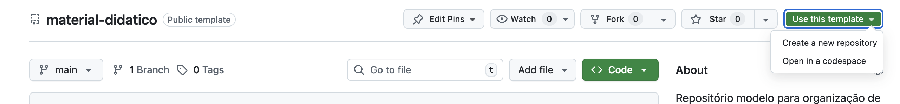

# Material Didático - {Modelo} 📁

Este repositório é um template a ser utilizado na criação de novos repositórios para organização e compartilhamento de material didático. Sua proposta é oferecer uma estrutura inicial básica de organização, comum às diferentes disciplinas e cursos, auxiliando docentes e estudantes na navegação de uma estrutura organizacional semelhante.

## Como começar

Para utilizar, você deve criar o repositório do seu curso ou disciplina a partir deste modelo. Você pode fazer isso a partir da interface do próprio GitHub, clicando em `Use this template > Create a new repository`:



Pronto, a partir daí você pode utilizar o seu repositório para estruturar o seu conteúdo.

### Criando e editando páginas

#### Estrutura de diretórios

A estrutura inicial de diretórios proposta é a seguinte:

```
.
├── index.md 📄
├── conteudo 📁/
│   ├── topico-a 📁/
│   │   ├── pagina-1.md 📄
│   │   └── pagina-2.md 📄
│   ├── topico-b 📁
│   └── topico-c 📁
├── imagens 📁/
│   ├── subpasta 📁
│   └── imagem.png 📄
└── recursos 📁/
    ├── apostilas 📁/
    │   ├── apostila-x.pdf 📄
    │   └── apostila-y.doc 📄
    └── apresentações 📁/
        ├── aula-1.pptx 📄
        └── aula-2.pdf 📄
```

- **index.md 📄**: Diretório inicial do site, ele será a página inicial que o GitHub pages irá utilizar, deve funcionar como um índice com links para os demais conteúdos do curso;
- **conteudo 📁**: diretório onde ficam organizados os documentos de aula em markdown, subdivididos em tópicos, aulas, ou outra organização adotada pelo docente;
- **imagens 📁**: imagens utilizadas nas páginas;
- **recursos 📁**: pasta onde podem ser armazenados apresentações e outros recursos didáticos (`.pptx`, `odp`, `.pdf`, etc.);

Recomenda-se preservar esta estrutura mínima, mas novos diretórios podem ser criados e a estrutura interna de organização dos conteúdos fica a cargo de cada professor.

### Publicando GitHub pages

---
<a href="https://creativecommons.org">Material Didático - {Modelo}</a> © 2025 por <a href="https://creativecommons.org">Allyson Souza</a> é licenciado sob a <a href="https://creativecommons.org/licenses/by-nc/4.0/">CC BY-NC 4.0</a>

<div style="display: inline;">
  <span></span>
  <span></span>
  <span></span>
</div>
