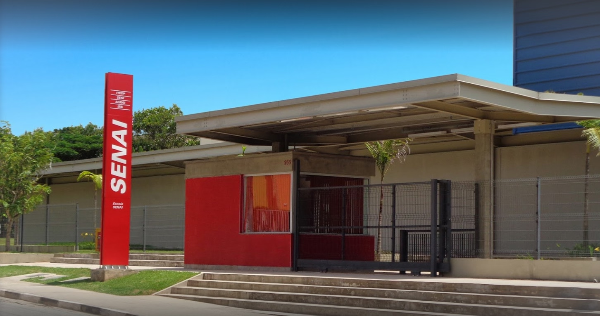

# Introdução

## Professor Allyson Souza

Professor no SENAI – Cotia, programador web com 15 anos de experiência, entusiasta do software livre.

Aluno na pós-graduação em Docência no Ensino Superior no IFSP (Instituto Federal de São Paulo).

> No tempo livre gosto de andar de bicicleta, nadar, beber café, assistir jogos do Corinthians, jogar videogame, ficar com meus amigos e família…

<aside>
✉️ [allyson.souza@docente.senai.br](mailto:allyson.souza@docente.senai.br)
</aside>

---

## Apresentação dos alunos

- Nome
- Idade
- Onde mora (Cidade/Bairro)
- Já teve contato com programação?
- Possui computador ou acesso fácil a computador?
- Por que escolheu o curso?

---

## Apresentação da instituição - SENAI Cotia: Ricardo Lerner

SENAI Cotia - "Ricardo Lerner"

**Endereço**: Rua Direita, 955 - Vila Santo Antônio - Cotia/SP - CEP: 06708-280

**Telefone**: (11) 4628-1600 **WhatsApp**: (11) 4628-1600

[https://sp.senai.br/unidade/cotia/](https://sp.senai.br/unidade/cotia/)

## Apresentação do plano de curso

Inserir link para o plano de curso.